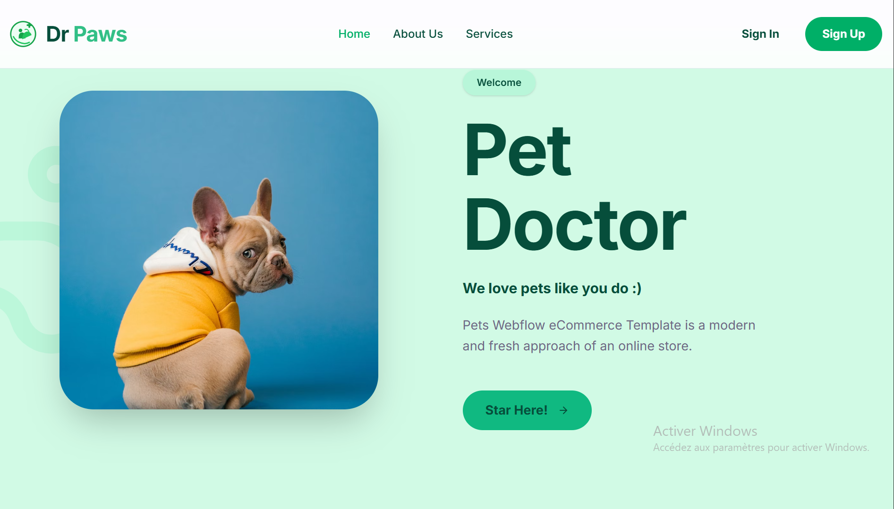
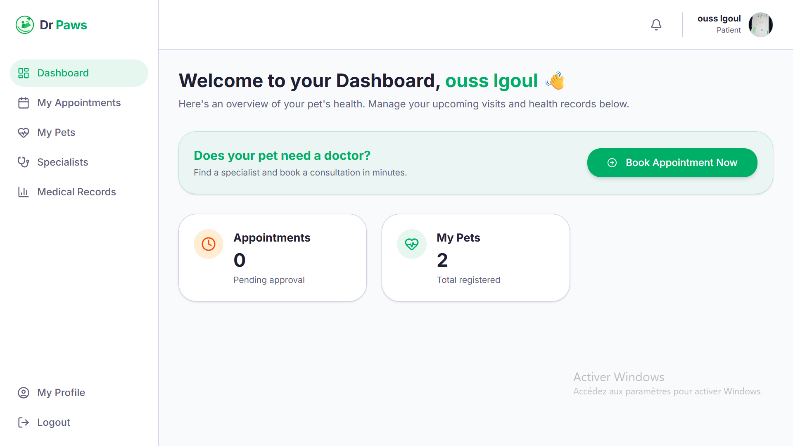
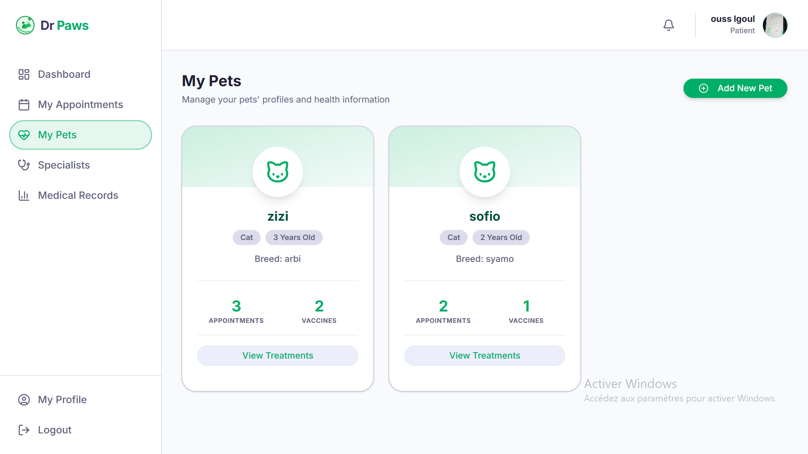
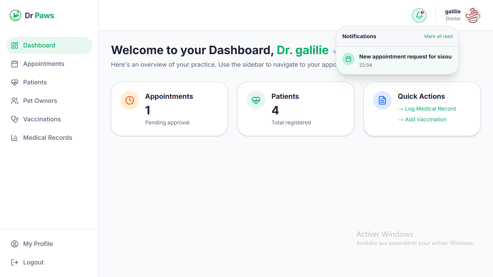
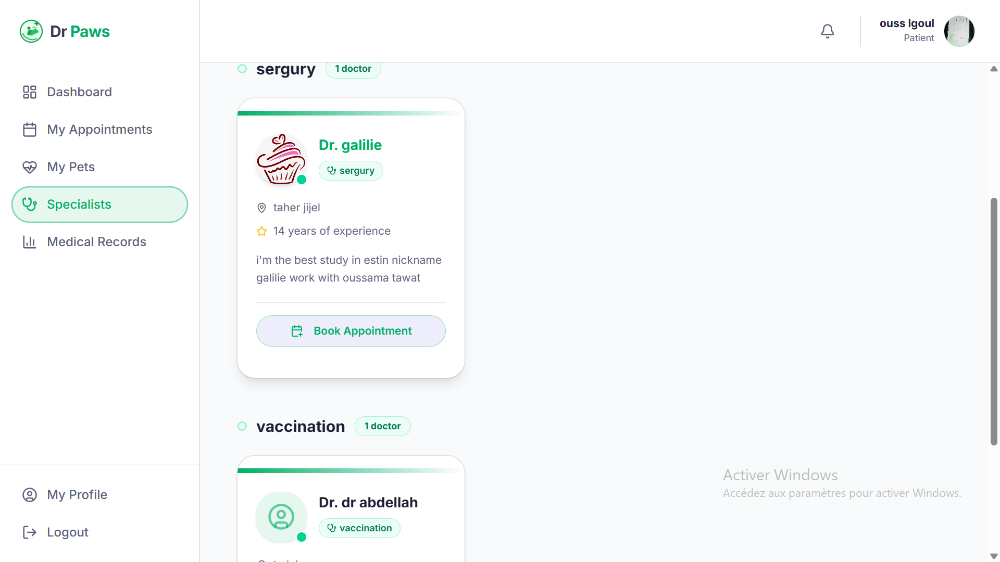

# VetX 🐾

> **The comprehensive web platform bridging the gap between pet owners and veterinarians in Algeria.**

---

## Problem Statement

Pet owners in Algeria often face challenges when trying to find and book reliable veterinary care. The traditional process is fragmented, involving:
- Searching for vets through unverified word-of-mouth or outdated directories.
- No centralized system to book, manage, or track appointments.
- Limited digital access to pet medical history or vaccination records.
- Communication gaps between owners and specialists.

## Solution

**VetX** provides a modern, full-stack solution tailored for the Algerian veterinary ecosystem. It offers a role-based experience:
- **For Pet Owners:** A seamless way to find specialists, book appointments, and manage their pets' digital health records.
- **For Veterinarians:** A professional suite to manage schedules, clinical records, and patient relationships efficiently.

---

## Technology Stack

### Frontend
- **Framework:** Next.js 16.2 (App Router)
- **Language:** TypeScript
- **Styling:** Tailwind CSS + PostCSS
- **Component Library:** shadcn/ui (configured with new-york style)
- **Icons:** `lucide-react` and `react-icons`
- **Animations:** `tw-animate-css`

### Backend & Services
- **Backend-as-a-Service:** Supabase
  - **Authentication:** Role-based (Patient / Doctor)
  - **Database:** PostgreSQL (with Row Level Security)
  - **Real-time:** Live appointment notifications
  - **Storage:** Pet photos and clinical attachments (PDF/Images)

### Development Tools
- **Package Manager:** npm
- **Build Tool:** Next.js (Turbopack)
- **Linting:** ESLint

---

## Features

### For Pet Owners
1.  **Authentication & Profile Management:** Secure login and role-based dashboard access.
2.  **Pet Management:** Register and manage multiple pet profiles (name, species, breed, age).
3.  **Veterinarian Search:** Browse and filter trusted specialists across different regions.
4.  **Appointment Booking:** Quick and easy booking with preferred veterinarians.
5.  **Appointment Management:** Track status (Pending, Confirmed, Completed) and view history.
6.  **Email Notifications:** Receive updates on appointment status changes.

### For Veterinarians
1.  **Registration & Verification:**
    - Register with professional details (license number, specialization, clinic name).
    - Admin approval workflow for verified status.
    - Secure account status management (Active/Suspended).
2.  **Dashboard:**
    - Overview of pending, confirmed, and completed appointments.
    - Quick stats and today's schedule view.
3.  **Appointment Management:**
    - Confirm or decline appointment requests (triggers notifications).
    - Add clinical notes, observations, and treatments.
    - Manage the full lifecycle of a visit (In Progress -> Completed).
4.  **Patient Records:**
    - View full pet medical history.
    - Access attached medical records (PDFs/Images).
5.  **Profile Management:**
    - Update professional info, services offered, and clinic availability.
6.  **Email Notifications:**
    - Alerts for new bookings and owner cancellations.

## Screenshots

### Landing Page

*Modern and welcoming landing page for VetX.*

### Patient Dashboard

*Overview of the patient dashboard and upcoming appointments.*

### My Pets

*Digital management of multiple pet profiles and health stats.*

### Veterinarian Dashboard

*Professional veterinarian interface with appointment management and notifications.*

### Specialist Search

*A searchable directory of verified veterinary specialists across Algeria.*

---

## Architecture

### Project Structure
```
veto-care/
├── src/
│   ├── app/              # App Router (Next.js)
│   ├── components/       # UI and Dashboard components
│   ├── lib/              # Supabase client and utilities
│   └── types/            # TypeScript definitions
├── public/               # Static assets
├── supabase/             # SQL migration scripts
└── .env.local            # Environment configuration
```

### Authentication Flow
1.  User registers/logs in via Supabase Auth.
2.  Auth trigger creates a entry in the `profiles` table.
3.  Application checks the `role` field to redirect to either `/dashboard` (Patient) or `/doctor` (Veterinarian).

### Routing Architecture
- `/` - Landing Page
- `/auth` - Login/Signup (Doctor & Patient paths)
- `/dashboard` - Patient root (Pets, Specialists, Appointments)
- `/doctor` - Veterinarian root (Patients, Schedule, Records)

---

## Setup & Installation

1.  **Clone the Repository:**
    ```bash
    git clone https://github.com/your-username/veto-care.git
    cd veto-care
    ```
2.  **Install Dependencies:**
    ```bash
    npm install
    ```
3.  **Environment Variables:**
    Create a `.env.local` file with your Supabase credentials:
    ```env
    NEXT_PUBLIC_SUPABASE_URL=your_project_url
    NEXT_PUBLIC_SUPABASE_ANON_KEY=your_public_key
    ```
4.  **Database Setup:**
    Run the SQL scripts in the `veto_care_master_schema.sql` file within your Supabase SQL Editor.
5.  **Run Locally:**
    ```bash
    npm run dev
    ```

---

© 2026 VetX — Professional Veterinary Care Simplified.
